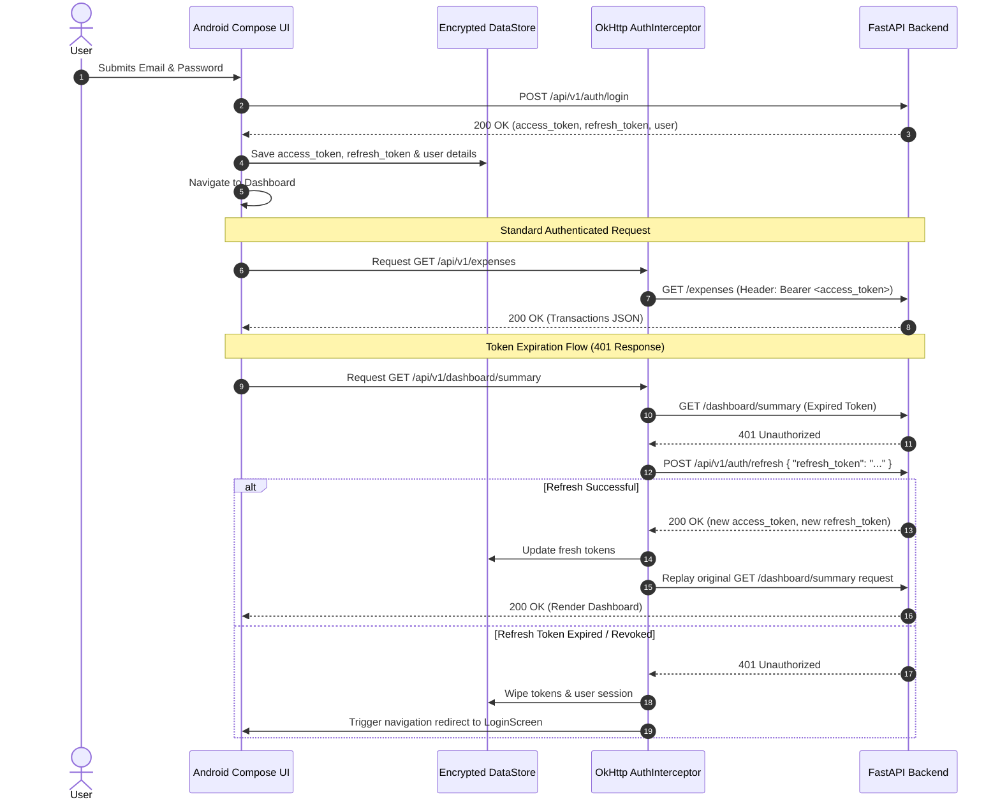

# FinTrack Android Mobile App — Frontend Requirements Specification (FRS)

**Project Owner / Lead Developer:** Samruddhi  
**Document Version:** 1.0.0  
**Target Architecture:** Android Native (Jetpack Compose + Material3 Dark Theme)  
**Backend:** FastAPI (Python 3.14 async) → PostgreSQL (SQLAlchemy 2.0 async + asyncpg)  
**Design System:** Obsidian Kinetic Finance ([`design.md`](file:///d:/Fintrack/design.md))  

---

## 📋 Table of Contents
1. [Executive Summary & Mobile Architecture](#1-executive-summary--mobile-architecture)
2. [Domain Entities & Data Models](#2-domain-entities--data-models)
3. [Complete API Endpoints & Contract Catalog](#3-complete-api-endpoints--contract-catalog)
4. [Authentication & Session Lifecycle Flow](#4-authentication--session-lifecycle-flow)
5. [Core User-Facing Feature Specifications & CRUD Operations](#5-core-user-facing-feature-specifications--crud-operations)
6. [AI Financial Intelligence Suite Specifications](#6-ai-financial-intelligence-suite-specifications)
7. [End-to-End User Journeys (Mobile-First Workflows)](#7-end-to-end-user-journeys-mobile-first-workflows)
8. [Mobile UI/UX Design System Tokens & Component Guidelines](#8-mobile-uiux-design-system-tokens--component-guidelines)
9. [Performance, Security & Quality Acceptance Criteria](#9-performance-security--quality-acceptance-criteria)

---

## 1. Executive Summary & Mobile Architecture

The **FinTrack Android Native Mobile Application** is designed to provide high-performance, real-time personal wealth management, automated expense tracking, smart budgeting, and an AI intelligence suite on Android devices.

### Architecture Stack:
* **Operating System:** Android 8.0+ (API Level 26+)
* **Architecture Pattern:** Clean Architecture + MVVM (Model-View-ViewModel) with Unidirectional Data Flow (MVI/UDF)
* **UI Framework:** Jetpack Compose (100% declarative UI with Kotlin 1.9+)
* **Design Language:** *Obsidian Kinetic Finance* (Dark neo-banking aesthetic with frosted glassmorphism)
* **Asynchronous & State Management:** Kotlin Coroutines & `StateFlow` / `SharedFlow`
* **Networking Layer:** Retrofit 2 + OkHttp 3 with dynamic IP switching and JWT Bearer Interceptors
* **Local Persistence & Tokens:** Jetpack Encrypted DataStore & SharedPreferences
* **Hardware Integrations:** CameraX (Vision OCR receipt scanning), Android Speech / Audio input (Voice expense logger)

---

## 2. Domain Entities & Data Models

### 2.1 User Entity
| Field | Type | Constraint | Description |
|---|---|---|---|
| `id` | `UUID / String` | Primary Key | Unique user identifier |
| `email` | `String` | Email Format, Unique | User account email |
| `full_name` | `String?` | Max 100 chars | Display name |
| `avatar_url` | `String?` | Valid URL | Optional profile avatar |
| `is_verified`| `Boolean` | Default: `false` | Email verification flag |
| `created_at` | `ISO-8601 Timestamp`| Read-Only | Account creation timestamp |

### 2.2 Expense Entity
| Field | Type | Constraint | Description |
|---|---|---|---|
| `id` | `UUID / String` | Primary Key | Unique transaction identifier |
| `user_id` | `UUID / String` | Foreign Key | Owning user ID |
| `category_id` | `UUID / String` | Foreign Key | Associated category ID |
| `category_name`| `String?` | Read-Only | Category title (joined) |
| `category_color`| `String?` | Hex Code | Category visual tag color |
| `title` | `String` | 1–100 chars | Expense description / merchant |
| `amount` | `Double / BigDecimal` | $> 0.00$ | Positive transaction amount (₹) |
| `date` | `String` | `YYYY-MM-DD` | Date of transaction |
| `payment_mode` | `Enum` | `cash`, `card`, `upi` | Payment channel utilized |
| `notes` | `String?` | Max 500 chars | Optional memo / remarks |
| `created_at` | `ISO-8601 Timestamp`| Read-Only | Timestamp of entry creation |
| `updated_at` | `ISO-8601 Timestamp`| Read-Only | Timestamp of last modification |

### 2.3 Category Entity
| Field | Type | Constraint | Description |
|---|---|---|---|
| `id` | `UUID / String` | Primary Key | Unique category ID |
| `user_id` | `UUID / String` | Foreign Key | Owning user ID |
| `name` | `String` | 1–50 chars | Category title |
| `color` | `String` | Hex Code | Visual color tag (e.g. `#6366F1`) |
| `icon` | `String?` | Text / Emoji | Optional category icon symbol |
| `is_default` | `Boolean` | Default: `false` | System seeded starter category |
| `expense_count`| `Int` | Computed | Number of active expenses in category |

### 2.4 Budget Entity
| Field | Type | Constraint | Description |
|---|---|---|---|
| `id` | `UUID / String` | Primary Key | Unique budget limit ID |
| `user_id` | `UUID / String` | Foreign Key | Owning user ID |
| `category_id` | `UUID / String?` | Foreign Key (Nullable)| Specific category UUID (or `null` for monthly cap) |
| `category_name`| `String?` | Read-Only | Category name if category-specific |
| `amount` | `Double` | $> 0.00$ | Monthly spending cap limit in ₹ |
| `spent` | `Double` | Computed | Total spent in current month towards this budget |
| `percentage_used`| `Double` | Computed | Utilization percentage (`spent / amount * 100`) |
| `month` | `String` | `YYYY-MM` | Active calendar month |

---

## 3. Complete API Endpoints & Contract Catalog

All backend requests target `/api/v1/` and require `Authorization: Bearer <access_token>` (except public auth endpoints).

### 3.1 Authentication Endpoints
```http
POST /api/v1/auth/register
Content-Type: application/json

Request:
{
  "email": "user@example.com",
  "password": "securePassword123",
  "full_name": "Samruddhi"
}

Response (201 Created):
{
  "access_token": "eyJhbGciOi...",
  "refresh_token": "eyJhbGciOi...",
  "token_type": "bearer",
  "expires_in": 1800,
  "user": {
    "id": "c1f7b8a2-...",
    "email": "user@example.com",
    "full_name": "Samruddhi",
    "is_verified": false,
    "created_at": "2026-09-09T05:00:00Z"
  }
}
```

```http
POST /api/v1/auth/login
Content-Type: application/json

Request:
{
  "email": "user@example.com",
  "password": "securePassword123"
}

Response (200 OK):
{
  "access_token": "eyJhbGciOi...",
  "refresh_token": "eyJhbGciOi...",
  "token_type": "bearer",
  "expires_in": 1800,
  "user": { ... }
}
```

```http
POST /api/v1/auth/refresh
Content-Type: application/json

Request:
{
  "refresh_token": "eyJhbGciOi..."
}

Response (200 OK):
{
  "access_token": "eyJhbGciOi...",
  "refresh_token": "eyJhbGciOi...",
  "token_type": "bearer"
}
```

```http
POST /api/v1/auth/forgot-password
Content-Type: application/json

Request: { "email": "user@example.com" }
Response (200 OK): { "message": "Password reset email sent if account exists" }
```

---

### 3.2 Category Endpoints
* **`GET /api/v1/categories`**: Lists all categories for authenticated user.
* **`POST /api/v1/categories`**: Creates category (`{ "name": "Gym", "color": "#6366F1", "icon": "🏋️" }`).
* **`PUT /api/v1/categories/{id}`**: Updates category metadata.
* **`DELETE /api/v1/categories/{id}?reassign_to_id={uuid}`**: Safely deletes category, reassigning existing expenses to prevent orphaned records.

---

### 3.3 Expense Endpoints
* **`GET /api/v1/expenses`**:
  * **Query Parameters:** `category_id`, `payment_mode` (`cash`/`card`/`upi`), `start_date`, `end_date`, `search`, `sort_by` (`date`/`amount`), `sort_order` (`asc`/`desc`), `page`, `limit`.
  * **Response:** `{ "items": List<ExpenseResponse>, "total": 52, "total_amount": 16400.0, "page": 1, "limit": 20 }`
* **`POST /api/v1/expenses`**: Creates expense (`{ "title": "...", "amount": 250.0, "category_id": "...", "date": "2026-09-09", "payment_mode": "upi" }`).
* **`GET /api/v1/expenses/{id}`**: Fetches detailed transaction record.
* **`PUT /api/v1/expenses/{id}`**: Updates transaction details.
* **`DELETE /api/v1/expenses/{id}`**: Deletes transaction record.

---

### 3.4 Budget Endpoints
* **`GET /api/v1/budgets`**: Returns list of all category and overall monthly budget targets.
* **`GET /api/v1/budgets/summary`**: Returns aggregated monthly budget status (`{ "total_budget": 30000.0, "total_spent": 18500.0, "total_remaining": 11500.0, "overall_percentage": 61.6 }`).
* **`POST /api/v1/budgets`**: Sets monthly budget ceiling (`{ "category_id": "uuid" (or null for overall), "amount": 5000.0, "month": "2026-09" }`).
* **`DELETE /api/v1/budgets/{id}`**: Deletes budget target.

---

### 3.5 Dashboard, Analytics & Reports
* **`GET /api/v1/dashboard/summary`**: Aggregates current month spending, MoM percentage change, payment mode breakdown (`upi`, `card`, `cash`), and recent 5 transactions.
* **`GET /api/v1/export/csv`**: Generates and downloads a CSV export file of filtered transactions.
* **`GET /api/v1/health`**: Verifies backend server and PostgreSQL database connectivity.

---

### 3.6 AI Financial Intelligence Suite Endpoints
* **`POST /api/v1/ai/categorize`**: Suggests best matching category for merchant/title (`{ "title": "Starbucks" }` $\rightarrow$ `{ "predicted_category_id": "...", "confidence": 0.94 }`).
* **`POST /api/v1/ai/parse-expense`**: NLP natural language and voice parser (`{ "text": "Paid 350 for Uber auto with upi" }` $\rightarrow$ parsed fields).
* **`POST /api/v1/ai/scan-receipt`**: Multipart image upload for OCR extraction (`merchant`, `amount`, `date`, `payment_mode`, `category_id`, `line_items`).
* **`GET /api/v1/ai/health-score`**: 0–100 Financial Health Gauge across 4 pillars (Budget Adherence, Burn Velocity, Concentration Risk, MoM Progression).
* **`GET /api/v1/ai/forecast`**: Predicts daily burn rate, projected month-end spend, safe daily allowance, and exhaustion day.
* **`GET /api/v1/ai/insights`**: Actionable insights on category spending spikes and savings wins.
* **`GET /api/v1/ai/anomalies`**: Detects subscription price hikes ($\ge 5\%$), duplicate charges, and category outlier spikes.
* **`POST /api/v1/ai/copilot`**: 24/7 Conversational financial assistant evaluating authentic PostgreSQL data.
* **`POST /api/v1/ai/split-bill`**: Equal/custom debt splitter with settlement matrix and WhatsApp export.
* **`GET /api/v1/ai/challenges` & `POST /api/v1/ai/challenges/claim`**: Gamified savings challenges with XP rewards and streak days.

---

## 4. Authentication & Session Lifecycle Flow



---

## 5. Mobile UI/UX Design System Tokens (Obsidian Kinetic Finance)

The Android app strictly implements the design tokens from [design.md](file:///d:/Fintrack/design.md):

### 5.1 Color Palette
```
┌─────────────────────────────────────────────────────────────┐
│                      COLOR PALETTE TOKENS                   │
├──────────────────────────────┬──────────────────────────────┤
│ Token Name                   │ Hex / RGBA Value             │
├──────────────────────────────┼──────────────────────────────┤
│ Canvas Baseline (Void)       │ #0B0F19                      │
│ Surface Tier 1 (Docked Base) │ #111827                      │
│ Surface Tier 2 (Glass Cards) │ #1C1F2A / rgba(30,41,59,0.70)│
│ Surface Tier 3 (Modals/Caps) │ #313540                      │
│ Primary Accent               │ #6366F1 (Electric Indigo)    │
│ Primary Light / Container    │ #C0C1FF / #8083FF            │
│ Secondary (Inflows/Surplus)  │ #10B981 (Neon Emerald)       │
│ Tertiary (Outflows/Alerts)   │ #F43F5E (Crimson Coral)      │
│ Outline & Hairline Traces    │ rgba(51, 65, 85, 0.55)       │
│ Text Primary (High Contrast) │ #F8FAFC (98% Luminance)      │
│ Text Secondary               │ #94A3B8                      │
│ Text Muted                   │ #475569                      │
└──────────────────────────────┴──────────────────────────────┘
```

### 5.2 Typography Scale
| Token | Font Family | Size | Weight | Tracking | Purpose |
|---|---|---|---|---|---|
| `displayLarge` | Plus Jakarta Sans | 40sp | Bold | -0.02em | Hero balance numbers |
| `displayMedium`| Plus Jakarta Sans | 32sp | Bold | -0.02em | Responsive balance figures |
| `headlineLarge`| Plus Jakarta Sans | 28sp | SemiBold | -0.015em| Main screen titles |
| `headlineMedium`| Plus Jakarta Sans| 22sp | SemiBold | -0.01em | Modal & drawer titles |
| `headlineSmall`| Plus Jakarta Sans | 18sp | SemiBold | 0em | Section headers |
| `titleLarge` | Inter | 16sp | SemiBold | -0.005em| Card prominent headers |
| `bodyLarge` | Inter | 16sp | Regular | 0em | Primary content body |
| `bodyMedium` | Inter | 14sp | Regular | 0em | Standard list items & forms |
| `bodySmall` | Inter | 12sp | Regular | +0.01em | Timestamps & captions |
| `labelLarge` | Inter | 13sp | SemiBold | +0.02em | Primary button labels |
| `labelMedium` | Inter | 11sp | SemiBold | +0.04em | Badges & category pills |
| `FinancialMono`| Inter (`tabular-nums`)| 15sp | Medium | -0.02em | Transaction table amounts |

---

## 6. Core User Journeys (Mobile-First Workflows)

### Journey 1: Quick Expense Logging (3-Way Assisted)
1. **Trigger:** User taps Floating Action Button `(+)` on Dashboard or Expense screen.
2. **Logging Pathways:**
   * *Manual Form:* Types title $\rightarrow$ `POST /ai/categorize` displays "✨ AI Suggest" category chip $\rightarrow$ enters amount $\rightarrow$ selects payment pill (`UPI` / `Card` / `Cash`).
   * *NLP Smart Quick Add:* Types sentence *"Dinner 450 with UPI"* $\rightarrow$ 1-tap parses into form fields.
   * *Voice Quick-Add:* Taps 🎙️ microphone, speaks *"Spent 350 for Uber auto with UPI"* $\rightarrow$ audio waveform pulses, transcribes, and pre-fills form.
3. **Save:** Taps **"Save Expense"** $\rightarrow$ Instant optimistic insertion, snackbar confirmation, and Dashboard recalculation.

### Journey 2: Vision OCR Receipt Scanning
1. **Trigger:** User taps 📷 Camera icon on Dashboard or AI Hub.
2. **Capture:** CameraX captures invoice/receipt photo.
3. **Processing:** Sends image to `POST /ai/scan-receipt`. Animated scanning radar visualizer displays progress.
4. **Result:** Displays extracted merchant, amount, date, payment mode, itemized line items, and category match.
5. **Instant Log:** User taps **"Log Expense Immediately"** $\rightarrow$ Saved with 0 manual typing.

### Journey 3: Financial Health & Safe Daily Cap Monitoring
1. **Balance Reveal:** User views Dashboard Hero Card with 40sp bold balance figure and taps 👁️ eye toggle for privacy in public spaces.
2. **Health Gauge:** User checks circular score gauge (`88 - Grade A+ Financial Master`).
3. **Forecast Card:** User checks daily burn velocity and safe daily spending allowance.
4. **Interactive Inquiries:** User taps the floating **AI Copilot** button to ask conversational questions (*"How much can I spend this weekend?"*).

---

## 7. Quality & Acceptance Criteria

1. **Zero Mock Data:** All screens (Dashboard, Expenses, Budgets, Health Gauge, Forecast, AI Hub) bind directly to authentic PostgreSQL database records.
2. **Network Resilience & Silent Token Refresh:** Expired access tokens automatically refresh via `AuthInterceptor` without forcing user logout; network dropouts show clean offline warning and retry buttons.
3. **Ergonomic Touch Targets:** All interactive controls (buttons, chips, payment pills) maintain a minimum $48\text{dp} \times 48\text{dp}$ touch footprint positioned within the lower 60% thumb reach zone.
4. **Monetary Decimal Precision:** All financial calculations strictly preserve 2 decimal places with Indian currency formatting (`₹1,450.00`) with zero floating-point arithmetic drift.
